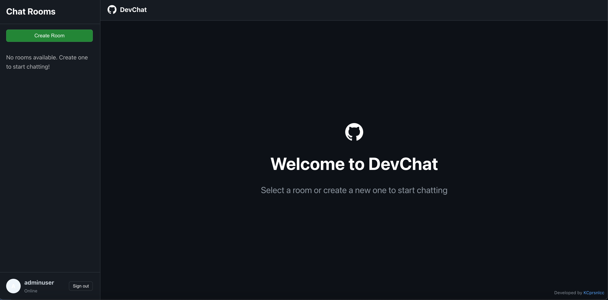

# DevChat

A real-time chat application inspired by GitHub's design and user experience. DevChat features a clean, modern interface with GitHub's dark theme color palette.



## Features

- **GitHub-inspired UI**: Clean, modern interface using GitHub's dark theme color palette
- **Real-time messaging**: Instant message delivery using WebSockets
- **Room-based chat**: Create and join different chat rooms
- **User authentication**: Secure login and registration system
- **Responsive design**: Works on desktop and mobile devices

## Future Features

- **Message Threading**: Support for threaded conversations and replies
- **Code Snippets**: Markdown and syntax highlighting for sharing code
- **File Sharing**: Ability to upload and share files in chat
- **User Profiles**: Customizable profiles with avatars and status indicators
- **Notifications**: Push notifications for mentions and messages
- **Search Functionality**: Ability to search through message history
- **End-to-End Encryption**: Enhanced security for private conversations

## Technology Stack

- **Frontend**: React, TypeScript, Styled Components
- **Backend**: Django, Django REST Framework, Django Channels
- **Database**: SQLite (default), can be configured for PostgreSQL
- **Real-time**: WebSockets with Django Channels
- **ASGI Server**: Daphne

## Getting Started

### Prerequisites

- Node.js (v14+)
- Python (v3.9+)
- Redis (for WebSocket channels)

### Installation

1. Clone the repository
   ```
   git clone https://github.com/KCprsnlcc/DevChat.git
   cd devchat
   ```

2. Set up the backend
   ```
   python -m venv .venv
   source .venv/bin/activate  # On Windows: .venv\Scripts\activate
   pip install -r requirements.txt
   python manage.py migrate
   ```

3. Set up the frontend
   ```
   cd frontend
   npm install
   npm start
   ```

4. Run the server (in a separate terminal)
   ```
   # Make sure you're in the project root directory with virtual environment activated
   ./run.sh
   # Or alternatively
   python run_server.py
   ```

5. Open your browser and navigate to `http://localhost:3000`

## Design Inspiration

DevChat's design is heavily inspired by GitHub's dark theme interface. The color palette includes:

- Background: #0d1117
- Dark Background: #161b22
- Text: #c9d1d9
- Light Text: #8b949e
- White: #ffffff
- Border: #30363d
- Primary: #58a6ff (links, accents)
- Button: #238636 (GitHub green)
- Error: #f85149
- Success: #3fb950

## License

This project is licensed under the terms outlined in the [License](LICENSE.md).

## Credits

Developed by [KCprsnlcc](https://github.com/KCprsnlcc) with AI assistance.
